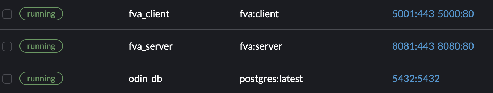

# FVA

## Prerequisites

**dotnet 8**:
https://dotnet.microsoft.com/en-us/download/dotnet/8.0

**docker**: https://www.docker.com/

**trusted certs**: [See dev-cert command](#dev-cert)

# Commands

This project uses a [Makefile](Makefile) to run commands. Any command can be run with
``make {COMMAND}``.

## Commands

### **start**

``` bash
make start
```

#### **Description**

Runs several commands to bring up the stack, client, api and db.

### **stop**

``` bash
make stop
```

#### **Description**

Stop the services and remove containers.

### **cleanup**

``` bash
make cleanup
```

#### **Description**

Cleans the output of the solution from the previous build.

Whilst not required everytime the project is built, it can help in resolving dotnet specific problems when assemblies
may not work correctly.

### **restore**

```bash
make restore
```

#### **Description**

Goes through the NuGet dependencies and downloads any missing dependencies or updates out of date dependencies.

### **build**

```bash
make build
```

#### **Description**

Build the solution, creating dll files in the bin/debug folder along with the executable.

### **run-client**

```bash
make run-client
```

#### **Description**

Runs the client application.

### **run-server**

```bash
make run-server
```

#### **Description**

Runs the server application.

### **docker-build-dev**

```bash
make docker-build-dev
```

#### **Description**

Build the image based on mcr.microsoft.com/dotnet/aspnet:8.0.
This is build with the arg ENV set to Debug to indicate to the
dotnet cli to build the assembly in debug.

### **docker-build-release**

```bash
make docker-build-release
```

#### **Description**

Build the image based on mcr.microsoft.com/dotnet/aspnet:8.0.
This is build with the arg ENV set to Release to indicate to the
dotnet cli to build the assembly in Release.

### **docker-run**

```bash
make docker-run
```

#### **Description**

Runs the build image and creates a container. Runs on port 8080

### **docker-stop**

```bash
make docker-stop
```

#### **Description**

Tears down the container.

### **migrate**

```bash
make migrate migration_name={MIGRATION_NAME}
```

#### **Description**

Creates a migration and updates the database.
Accepts a "migration_name" parameter

### **roll-back-migration**

```bash
make roll-back-migration previous_migration={PREVIOUS_MIGRATION}
```

#### **Description**

Rollback migrations to a specific named migration.
Accepts a "previous" parameter

### **format**

```bash
make format
```

#### **Description**

Runs dotnet format which targets the solution and formats code.

### **dev-cert**

```bash
make dev-cert
```

#### **Description**

Generates a self-signed development certificate that gets copied to the container
to allow for https use. This command is configured to be run on MacOS.

**_MUST BE RUN TO DEVELOP LOCALLY_**

## Port Mapping and docker setup

The project is split into 3 services **Server** and **Client**. There are 2 top level docker
files [Dockerfile-Server](Dockerfile-Server) and [Dockerfile-Client](Dockerfile-Client).

_Note: The third service is the database which does not have a dockerfile. Instead, it is build in the docker-compose
see [here](docker-compose.yml) for more._

Each take an argument to define whether the container built is debug or release.
See [docker-build-dev](#docker-build-dev) and
[docker-build-release](#docker-build-release).

When the containers are built they are accessible by the names assigned to them in the docker-compose. When built successfully it should look something like this



The ports exposed on each service is both port 80 and 443. Below is a mapping of the ports.

### Server

- Port **8080** on host machine is mapped to **80** in container for _http_
- Port **8081** on host machine is mapped to **443** in container for _https_

### Client

- Port **5000** on host machine is mapped to **80** in container for _http_
- Port **5001** on host machine is mapped to **443** in container for _https_
